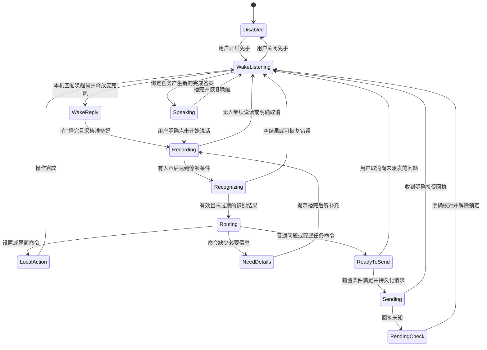
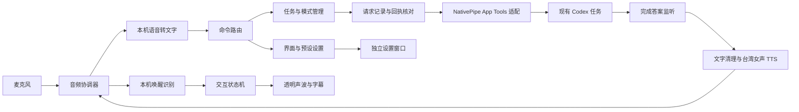

# 声伴：桌面语音助手产品与技术框架

> 2026-09-10 整理说明：本文保留原版本记录与方案。当前功能状态以[功能总表](功能总表.md)为统一入口，后续改造以[架构设计](架构设计.md)、[开发规范](开发规范.md)和[实施与验收计划](实施与验收计划.md)为评审依据；下文旧版本的“当前／尚未实现”不直接代表 0.6.12。

**0.6.7 范围注记：**下文的 v5 基线、界面预览和“尚未实现”描述保留为当时的规划记录，不再代表当前程序状态。v6 已实现六种透明声波、独立设置与字幕、常用设置口令、已有任务切换及单项语音新建；新建默认独立任务，显式当前项目需精确匹配，使用 Codex 配置的默认模型。0.6.7 已重新加载，但新建只通过隔离回归，未真实创建或发送测试。快速／深度模式、任意项目选择以及“新建并执行工作”的复合口令仍是规划；朗读中唤醒的真人效果与公开新机验收也仍有边界。当前状态以 [使用说明](使用说明.md)、[功能记录](功能记录.md) 和 [测试说明](../tests/README.md) 为准。

更新日期：2026-09-08。本文记录 v5 已完成基础与后续开发框架，**不代表下述功能已经全部实现**。状态以本页“当前基础与后续范围”为准。文中的操作示例没有触发实际任务创建或模型变更。

最新评审补充：用户要求声波形状不限圆形，支持可切换的环形和条形样式，并增加朗读语速调整；“朗读时喊唤醒词立即停读，继续听问题”列为第一批必须完成的功能。换电脑后连接用户自己的 Codex 是公开版核心验收项，详见[首次连接与换电脑方案](首次连接与换电脑方案.md)。当前 v5 仍不支持朗读中唤醒；以下对 v5 的限制说明是现状，不是最终产品行为。最新交互和验收以[公开版整体方案](公开版整体方案.md)为准。

## 1. 要做成什么

桌面平时只显示用户选定的声波图形，既支持中间镂空的环形，也支持条形。用户喊醒助手，它回答“在”；用户继续说问题，说完停顿，助手自动转成文字交给绑定的 Codex 任务。该任务继续用用户选择的 GPT‑6 思考和操作；完成后，助手显示可选字幕，再用选择的声音和语速读出回答。声波本体支持左键拖动、右键打开菜单；置顶、打开设置和隐藏图形均从菜单操作，托盘保留恢复入口。

用户也可以直接说“新建一个任务，帮我……”“切到快速模式”“切到 GPT‑6 深度模式”。这些是助手的控制命令，由明确的命令路由处理。每个模式的模型、思考强度和朗读偏好，都能在独立设置界面里手动配置。

语音识别、负责回答的模型、朗读声音是三个独立部分。切换“快速／深度”改变的是 Codex 请求使用的预设；同一个台湾女声仍然负责朗读。第一版继续沿用用户已登录的 Codex 及其已有使用额度，不要求额外填写 OpenAI API Key。

## 2. 当前基础与后续范围

下表以当前项目文件及 `tests/Test-HandsFreeIntegration.ps1` 的通过结果为基线。v5 已通过真实组件链路测试；其中自动发送使用 TestMode，只准备一次派发，没有实际向 Codex 任务发送。透明 UI、命令路由和模式设置仍是后续功能。

| 状态 | 能力 | 已有边界或剩余工作 |
| --- | --- | --- |
| 已完成：v4 基础 | 置顶悬浮面板、收起文字区、托盘入口 | 目前仍是有面板的窗口；用户新要求的透明声波外观尚未实现 |
| 已完成：v4 基础 | 点击录音、本机 SenseVoice 转文字、手动发送 | 停止录音后识别，暂不逐字输出实时字幕 |
| 已完成：v4 基础 | 手动录音可选“停顿两秒后自动发送” | 用按钮开始的录音可选此项；v5 免手录音单独默认自动发送；音量活动结束不等于语义上说完 |
| 已完成：v4 基础 | 绑定明确的现有本机 Codex 任务并发送文字 | 通过现有 NativePipe App Tools 桥接；保持任务已有模型和权限 |
| 已完成：v4 基础 | 读取完成的回答、台湾女声自动朗读 | 不把推理内容或过程评论作为最终答案朗读 |
| 已完成：v4 基础 | 开始录音先停读；其他程序使用麦克风时停读 | 普通点击、打字、拖动、窗口失去焦点不会取消朗读；明确切换任务、发送、录音、退出有各自行为 |
| 已完成：v4 基础 | 持久保存待确认发送，避免未知回执时重复发送 | 支持到 Codex 核对后手动解除当前任务锁；不能把超时当成“肯定没发出去” |
| 已完成：v5，组件真实链路测试通过 | “你好，声伴”→“在”→录问题→停顿两秒→识别后自动发送 | 唤醒准备约两秒；八秒没有开始说问题则回待机。测试只准备一次自动派发，TestMode 没有实际发到任务 |
| 已完成：v5，组件真实链路测试通过 | 朗读暂停唤醒、读完恢复、关闭免手释放麦克风 | 已验证含唤醒词的答案不会自行唤醒；暂不支持朗读中的语音打断 |
| 已完成：v5 | 窗口复选框／托盘开关；免手录音最小化继续 | “语音唤醒”和托盘“免点击语音唤醒”同步；手动录音最小化仍取消 |
| 后续开发 | 透明声波常驻桌面、轻量字幕、独立设置窗口 | 取代现有大面板作为默认日常界面 |
| 后续开发 | 语音新建／切换任务、语音切换预设 | 当前桥接只提供现有任务读、列、发送、打开；需扩展命令与能力适配 |
| 后续开发 | 手动配置快速、GPT‑6 深度、自定义模式 | 需验证模型／思考强度组合、应用时机和重启后保存 |

现有说明入口：[使用说明](使用说明.md)、[语音接口说明](语音接口说明.md)。

v5 的待唤醒音频只在本机内存中匹配，不保存音频文件、不上传；问题录音仍在本机转文字后清理。朗读使用用户已授权的微软在线台湾女声，发送待朗读的答案文字。组件测试采用固定音频驱动真实唤醒／ASR 模型，并验证实际麦克风交接和 TTS 播放；不把这项结果写成已经完成真实任务的自动发送验收。测试结果位于 `work/tests/handsfree-integration/result.json`。

## 3. 桌面上的三个界面

### 透明声波

默认只留下声波和必要的短状态，背景透明、无大块底板，可拖动、可置顶，并记住显示器与位置。空白区域不应挡住桌面或其他程序的点击；声波本体保留明确操作区域，右键或托盘始终可以打开设置、停止朗读、关闭免手模式和退出。

待唤醒时保持安静的低幅提示；用户说话时跟随真实麦克风音量变化；Codex 处理中显示不同于录音的轻微等待动画。朗读时可先用明确标记的播放动画，若要称为“声音波形”，再接入实际输出音频幅度。

任务名称与预设名可以短暂显示在声波旁，例如“语音助手开发 · GPT‑6 深度”。进入新任务、切换模式、发送失败时主动显示，避免极简界面让用户不知道内容会发到哪里。

### 可选字幕

在声波旁短暂显示“正在听”“正在处理”“发送待核对”，以及用户刚说的内容和最新答案。字幕可折叠、固定或手动展开全文；不为了显示完整长回答而强制恢复大面板。链接、代码和长表格保留在文字视图，朗读只做格式清理，不擅自编写另一份答案。

### 独立设置窗口

设置用普通清晰窗口承载，不塞进声波中。用户可以手动调整唤醒、录音、声音、模式、任务绑定与外观；修改模式后显示“下一轮生效”。任务列表保留标题原文，可截断显示并提供完整提示。

## 4. 语音交互与命令路由

下列话术包含已经完成的 v5 唤醒流程，以及尚待开发的任务／模式命令示例，**不是本次对话已经授权执行的真实动作**。当前默认唤醒词为“你好，声伴”。

| 用户说的话 | 助手应做什么 | 简短反馈 |
| --- | --- | --- |
| “你好，声伴” | v5 已支持：暂停并释放唤醒采集，回应后开始录问题 | “在。” |
| “帮我看看这个问题怎么处理。” | 作为普通问题发送给当前绑定任务 | “已发送。”或仅显示状态，避免频繁插话 |
| “再补充一点，文件名不要改。” | 同一任务若正在处理，作为补充交给现有任务桥接 | “补充好了。” |
| “切到快速模式。” | 选择名为“快速”的本地预设；不发送空消息，不重跑当前回答 | “下个问题用快速模式。” |
| “切到 GPT‑6 深度模式。” | 选择经过验证的 GPT‑6 深度预设 | “下个问题用 GPT‑6 深度模式。” |
| “切到快速模式，帮我解释这段话。” | 分解为选择预设和一次新问题；按新预设派发一次 | 若上一轮未结束，说明等待下一轮 |
| “新建一个任务，帮我整理旅行计划。” | 用给定内容创建一次新任务；准备好后绑定它 | “新任务准备好了。” |
| “新建一个任务。” | 收集缺少的任务内容；已有默认位置时不重复询问位置 | “新任务要做什么？” |
| “在〈项目名〉里新建任务，检查启动错误。” | 先核对项目，再按该项目环境建立任务 | 项目重名时列出候选，确认后继续 |
| “切到〈任务标题〉。” | 精确匹配可用任务；唯一匹配时读取并绑定 | “已切到〈任务标题〉。” |
| “打开设置。”／“打开当前任务。” | 打开助手设置／Codex 对应任务页面 | 无需额外确认 |
| “重读上一条。” | 重播上一条完整回答 | 开始朗读即可 |
| “取消这句话。” | 取消尚未派发的录音、识别或待发问题 | “这句话已取消。” |

命令只来自用户本次有效录音。Codex 的回答、任务标题、文档、网页及 TTS 播放内容都不能成为命令输入。“比如可以新建一个任务”“如果切到快速模式会怎样”是讨论内容，不执行创建或切换。第一版优先采用清晰的完整命令句与有限别名，避免靠关键词包含判断。

明确且信息完整的命令直接执行。只有缺少必要参数、任务重名、识别不确定或已有未知回执时才做有针对性的澄清，不给每次说话增加固定确认步骤。所有本地命令执行后均有可见状态；无匹配内容按普通问题送入任务，不执行任意本地 shell。

“停止朗读”和“停止 Codex 工作”是独立动作。第一阶段只接已验证的停止音频路径；停止 Codex 轮次需要单独接入可靠能力后再提供。不能用关闭声波、关闭播放器或普通点击冒充任务已经停止。

### 语音新建任务的完整流程

1. 从用户明确命令提取任务内容、可选标题、目标项目和预设；“比如新建”不进入该流程。
2. 未指定项目时使用用户在设置中选定的默认创建位置。尚未设置则一次性询问；支持本机无项目任务。
3. 指定项目时先查 `list_projects`，使用返回的 `projectId`。Git 项目默认 worktree，非 Git 项目用 local；用户明确要求直接使用保存的项目时遵从该选择。不要猜分支名。
4. 持久保存这次创建的请求编号及目标信息，只派发一次 `create_thread`。初始问题已经作为 `prompt` 送入新任务，不能在创建完成后再重复发送一次。
5. 返回真实 `threadId` 后读取确认并绑定；若只返回 `clientThreadId`，显示“正在准备任务”，通过能力允许的状态／任务列表解析成真实任务后再绑定。不能把临时编号当任务编号发送。
6. 创建超时或回执不明时保留创建记录并提示核对，不自动再创建。用户有明确未解决的发送状态时，不能把该消息默默转移到新任务。

## 5. 模式：用户可配置的请求预设

模式是本应用给一组参数起的名字。模型与思考强度需要分别保存；“快速”不自动代表换成另一种语音模型，也不擅自等同官方 Fast 服务层。

| 预设示例 | 模型 | 思考强度 | 规则 |
| --- | --- | --- | --- |
| 跟随当前任务 | 不传 `model` | 不传 `thinking` | 保持任务当时已有的设置，不声称还原到历史初始设置 |
| 快速 | 可配置；优先允许仍用 GPT‑6 | 例如 `low` | 只是较低思考强度的配置示例，不承诺固定响应时长 |
| GPT‑6 深度 | 当前主机已声明的 `gpt-6-astra` | 例如 `high`，可改为受支持的其他值 | 保留用户明确选择的 GPT‑6 |
| 自定义 | 用户选择可用模型 | 该模型实际支持的选项 | 模型失效时提示，不静默降级或换模型 |

当前主机公开的 App Tools schema 声明 `gpt-6-astra` 支持 `low / medium / high / xhigh / max / ultra`。这是 2026-09-08 的当前主机能力快照，不是永久硬编码列表；其他主机、账号和后续版本须重新核对。

切模式只改变本地“下一轮采用的预设”。只有用户下一次真正提交内容时，桥接才附带相应 `model` 和 `thinking`。当前正在生成的回答继续原来的模式，不取消、不重跑，也不把模式命令伪装成普通问题让模型自行猜测。

正在处理时，普通补充仍可发送到该轮；如果用户要求新预设立即用于新问题，则保留该问题，等本轮完成后再开始新轮。界面明确显示“本轮继续原模式；新问题等待用〈预设〉发送”。遇到运行状态变化，不以强制中断实现模式切换。首次实现需验证 NativePipe 工具对活动任务和模型覆盖的真实行为；未证实的组合保持待发并提示，不宣称已切成功。

“跟随当前任务”意味着省略覆盖字段。显式切过模型后，Codex 自身可能保留新的任务设置，因此它不是“恢复最初模型”的同义词；要恢复某个配置，应选已保存的具体预设。

## 6. 状态机

音频状态与 Codex 任务状态分开管理。Codex 正在工作时，音频可以重新等待唤醒；“正在生成”不等于“发送尚未成功”。



上图是目标逻辑，不是当前所有代码状态的说明。所有状态都应响应明确退出；退出立即停止本机采集和播放。已派发的桥接请求保留回执处理，退出不撤回 Codex 已收到的工作。

v5 已采用轮流听说：唤醒、听问题期间不开朗读；播放“在”和答案期间暂停唤醒并释放麦克风，读完恢复。这样避免助手把自己读的内容再发回去。**当前不支持朗读中直接说话抢断**；用户可点明确的开始说话／停止朗读入口。若以后需要完全免点击抢断，应另做可验证的回声消除和全双工音频方案。

### 状态机必须守住的约束

- 每次录音绑定 `utteranceId`、`generation`、`threadId`、预设版本和时间。取消、任务切换、关闭免手或退出均使该代失效，迟到结果不得更新输入框或发送。
- 唤醒回复播完后再录问题，避免把“在”识别成用户命令。多次连续唤醒不创建多个并发录音或多个发送。
- 同一时间只允许一个问题录音／识别流程。用户新问题与已有未发草稿分开；不能无声拼接旧草稿后自动发出。
- 只读桥接占用时，可以等待尚未派发的请求；一旦派发就进入已持久化请求的回执流程，不把它放回普通自动重试队列。
- 明确接受才能显示“已发送”；明确拒绝才能结束本次未成功派发；其余状态保留待核对。发送与创建各自有编号，重启后也不能重复提交。
- 只朗读当前绑定任务的新完成答案，按任务／轮次／答案编号去重。过程评论、推理、历史已读答案及旧任务迟到的完成事件不串入当前朗读。
- 用户录音期间新答案先排队；开始新问题时，旧朗读队列按既有停止策略失效，不在用户说话时突然播放。
- 没有后续人声、空识别、噪声和只有唤醒词时不发送；有限超时后回到可唤醒状态。

## 7. 技术模块与分工



| 模块 | 职责 | 现有基础／拟新增部分 |
| --- | --- | --- |
| 桌面外壳 | 透明窗口、声波、字幕、托盘、设置入口 | 沿用 PowerShell/WPF，分离现有面板视图与业务状态；不因换外观重写桥接 |
| 音频协调器 | 串行管理唤醒采集、问题录音、回复播放；设备释放与错误恢复 | v5 已通过 `HandsFree.ps1`、`JarvisRecorder.cs`、`MicGuard.cs`、`AudioPlayer.cs` 的阶段交接测试 |
| 唤醒工作进程 | 本机匹配唤醒词、返回事件与编号 | v5 已接入 `wake_worker.py` 和 `WakeListener.cs`；待唤醒音频仅在本机内存处理 |
| ASR 工作进程 | 有效人声检测、本地文字结果、耗时与错误 | 已有 `transcribe.py`；后续可常驻模型，必须关联各次请求和结果 |
| 命令路由 | 区分普通提问、任务命令、预设命令、界面命令；补齐必要参数 | 新增有限命令语法与别名，不执行来自答案的命令 |
| 任务管理 | 显式绑定、选择、创建准备状态、切换时使旧录音失效 | 复用 read/list/open，新增 projects/create 与真实任务编号解析 |
| 模式管理 | 预设存储、能力校验、下一轮生效、显示当前与待生效模式 | 新增；不修改 Codex 权限，不读取或搬运账号凭证 |
| 桥接适配 | 统一读、发、创建、列项目等工具，隐藏传输细节 | 复用 `codex_bridge.py` 的 NativePipe；新增能力前只读检查实际工具目录和输入 schema |
| 请求记录 | 派发前持久保存、回执解析、重复抑制、未知状态恢复 | 复用 pending 与 SQLite 记录；扩展至创建命令，不假设服务端天然幂等 |
| 结果与朗读 | 监听当前任务完成答案、去重、格式清理、TTS 与重读 | 复用当前最终答案监听和 `synthesize.py`；不另用一个回答模型改写内容 |
| 测试与诊断 | 注入固定录音、模拟工具回执、检查状态转移和延迟 | 现有 tests/work 测试路径继续与日常用户数据隔离 |

## 8. Codex 接口边界：先用现有可靠桥接

### 当前工具 schema 已核对的能力

以下来自当前会话实际提供的 `mcp__codex_app__*` 工具声明；这不代表桌面语音助手的 Python 适配器已经实现全部动作。

| 工具 | 与本项目有关的字段／行为 | 本项目接入方式 |
| --- | --- | --- |
| `send_message_to_thread` | `threadId`、`prompt`，可选 `hostId`、`model`、`thinking`；省略模型／强度保留现有设置 | 原有发送路径保留；用户选择具体预设后才加入覆盖字段 |
| `list_projects` | 返回可创建任务的项目及 `projectId`、`isGitRepository` | 有项目的新建命令先查；不从识别文本拼造项目编号 |
| `create_thread` | 必需 `prompt`、`target`，可选 `title`、`model`、`thinking`；目标支持 project／projectless 等 | 首期限定本机 Codex；明确用户新建命令才调用，不默认创建云任务 |
| `create_thread` 结果 | 准备好时有 `threadId`／`hostId`，准备中可能只有 `clientThreadId` | 显示准备状态，等待可用真实编号后绑定 |

`thinking` 是上述 App Tools 的字段名；不要直接混用 App Server 的 `effort`。`target` 的环境由项目真实信息和用户选择决定。创建工具要求用户明确要求一个新任务；讨论功能示例本身不属于调用依据。

### 官方协议作为能力参考和后续适配边界

官方文档提供 `model/list` 查询模型及推理强度，`thread/start` 建立任务，`turn/start` 开始轮次并可设置 `model`／`effort`，`turn/steer` 向正在进行的轮次补充输入但不支持该轮的模型覆盖。这支持“能力校验后选模式、下一新轮应用、当前轮不重跑”的设计。[OpenAI 官方 App Server 文档](https://learn.chatgpt.com/zh-Hans/docs/app-server)

当前 Windows 机器先前的默认 app-server socket／proxy 路径没有验证可用，已有工作路径是桌面自身提供的 NativePipe App Tools。因此本阶段不新开一个 app-server 去接管正在工作的任务，也不假设新进程天然共享原任务的运行状态。

优先对现有 NativePipe 做工具能力探测。模型列表若只能从当前主机工具声明获取，就显示核对过的能力并在调用时校验；不能伪装成已经连通 `model/list`。将来只有在真实共享连接、任务一致性、事件与权限都验证通过后，才增加官方 App Server 适配器。所有适配器在界面之下替换，不改变用户的任务绑定。

## 9. 设置界面与保存字段

以下是拟定配置结构，非当前 `data/settings.json` 已有字段的完整描述。当前保存任务、声音、手动录音自动发送、免手开关和唤醒词等基础项；独立设置窗口与模式预设尚未实现。新增结构要有版本、迁移、校验和原子写入；凭证不写入配置。

| 设置页 | 用户可调项 | 建议字段 |
| --- | --- | --- |
| 唤醒与说话 | 免手开关、唤醒词、麦克风、敏感度、无人声超时、说完停顿时长 | `handsFree.enabled`、`wake.phrase`、`audio.inputDeviceId`、`wake.threshold`、`recording.noSpeechTimeoutMs`、`recording.endSilenceMs` |
| 朗读 | 台湾女声、音量、语速、是否自动读、字幕是否同步显示 | `tts.voiceId`、`tts.volume`、`tts.rate`、`tts.autoRead`、`caption.enabled` |
| 模式 | 新建／改名／删除预设、语音别名、模型、思考强度、默认预设 | `presets[].id/name/aliases/model/thinking`、`defaultPresetId`、`threadPresetSelections` |
| 任务 | 当前绑定任务、默认创建位置、项目、环境偏好 | `binding.threadId/hostId`、`taskDefaults.targetType/projectId/environmentPreference` |
| 外观 | 置顶、大小、屏幕位置、字幕长度、静止透明度、点击穿透范围 | `overlay.topmost/scale/position/idleOpacity/hitTestMode`、`caption.maxLines` |
| 常规 | 开机启动选择、托盘行为、明确操作的快捷键 | `startup.enabled`、`window.closeBehavior`、`hotkeys` |
| 连接与恢复 | 当前连接状态、打开任务、待核对发送、诊断信息 | 状态只读；明确操作入口复用既有回执核对逻辑 |

模型与推理强度下拉框联动；不支持的组合禁止保存并说明原因。语音别名重复时提示冲突；已有任务及新任务的预设应用范围明确区分。保存唤醒词或音频设备时先结束本机旧监听，再按新设置启用，避免两个麦克风流程并行。

示例预设仅说明数据形状，实际保存以用户选择为准：

```json
{
  "schemaVersion": 1,
  "defaultPresetId": "inherit",
  "presets": [
    { "id": "inherit", "name": "跟随当前任务", "aliases": ["跟随任务"], "model": null, "thinking": null },
    { "id": "quick", "name": "快速", "aliases": ["快速模式"], "model": "gpt-6-astra", "thinking": "low" },
    { "id": "deep", "name": "GPT-6 深度", "aliases": ["GPT6深度模式", "深度模式"], "model": "gpt-6-astra", "thinking": "high" }
  ]
}
```

`null` 在配置中表示跟随任务；构造工具请求时应省略相应字段，而不是发送 JSON null。示例不改变现有用户模型，也不承诺快速预设的具体耗时。

## 10. 可验收标准

| 验收项 | 通过标准 |
| --- | --- |
| 外观 | 启动后默认只有透明声波与必要短提示；没有现有大面板底板；空白区域不拦截其他窗口点击 |
| 唤醒链路 | 实际说唤醒词，只回应一次“在”；回应播完才录问题；停顿后形成且发送一条有效文字 |
| 自读回声 | 播放唤醒回复和答案时不进入识别／发送；普通点击、切到其他软件不使朗读意外取消 |
| 无人声 | 唤醒后不说话能自动回待机；静音、测试噪声、空识别不产生任务消息 |
| 保持模型 | 跟随任务时请求无模型覆盖；GPT‑6 预设使用实际声明的 GPT‑6 标识，不降级替换 |
| 模式切换 | 说切模式只保存预设；下一新轮验证所用模型与强度；进行中的回答不重启 |
| 补充内容 | Codex 处理中能继续收到当前轮补充；新模式的新问题等待新轮，不伪装为当前轮已经换模型 |
| 新任务 | 一次明确创建命令只产生一个任务和一次初始问题；准备阶段不向临时编号发消息 |
| 任务切换 | 多个同名任务必须明确选择；未匹配不猜最近任务；切换后旧录音与旧结果不发送到新任务 |
| 防重复 | 模拟超时、断开、重复完成事件、退出后重启，均不重复发送／创建；未知状态可明确核对恢复 |
| 取消与迟到 | 识别较慢时取消或退出，随后出现的结果也不更新新会话或自动发送 |
| 配置 | 手动设置与语音切模式一致；重启后保留选择；错误组合有解释且不回退到其他模型 |
| 朗读 | 当前绑定任务的一条完成答案只自动读一次；TTS 失败仍能看到原文字并手动重读 |
| 延迟 | 分别记录唤醒到回应、回应结束到开始录音、静音结束到识别完成、派发回执时间；先实测再设目标，不编造秒数承诺 |

开发验证优先用模拟桥接和固定音频。真实发送、新建和模型切换测试应在用户明确指定的测试任务／范围中进行；文档编写不会触发这些动作。

## 11. 实现顺序

1. **v4 基础已具备，持续保留。** 现有可靠发送、最终答案监听、朗读停止规则和未知回执防重复，在后续改动中保留。
2. **v5 免手组件链路已通过。** “你好，声伴”→“在”→自动录音→本机转文字→单次派发准备，以及无声超时、朗读暂停唤醒与恢复已验证。TestMode 阻止真实任务发送；真实自动发送的现场验收应单独记录。
3. **改为透明声波外壳。** 将现有大面板从默认界面移走；保留可选字幕、托盘和明确停止入口。普通桌面操作继续不打断助手。
4. **建设设置与预设。** 先让手动配置、保存、校验和下一轮应用工作稳定，再增加“快速／GPT‑6 深度”等语音别名。
5. **扩展命令路由与任务能力。** 先接打开设置、模式选择、明确任务绑定；再接项目列表、语音新建、准备中任务追踪与创建防重复。
6. **整体验收与体验优化。** 验证正在处理时补充、切模式等待、断连恢复、退出迟到结果、多人名／任务名歧义；依据实测决定是否常驻 ASR 模型及优化字幕。

朗读中唤醒已提升为第一批目标，需要完成播放参考、回声消除、持续唤醒及打断后音频交接的实测，当前不能宣称已经支持。云端独立语音模型、自动跟随 Codex 当前界面任务仍不作为第一阶段的已完成承诺。任务继续明确绑定，保持原任务的模型选择。
