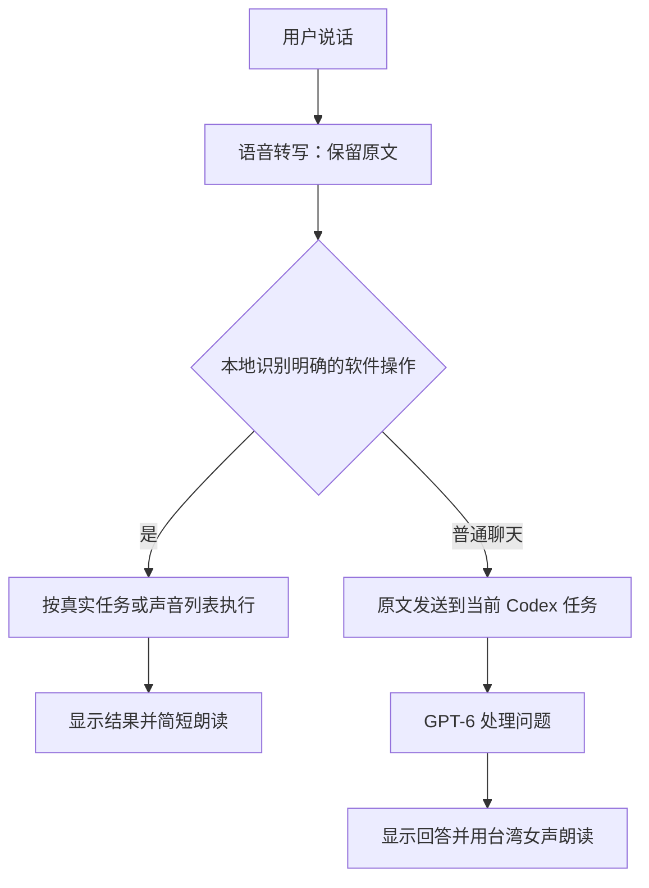

# 声控直达方案

2026-09-09，基于声伴 0.6.9。本文是方案，不代表以下新增功能已上线。本轮不更改正在运行的语音入口或任务绑定。

后续进展：0.6.10 已落地第一步的创建口令别名，支持“创建新任务／创建新对话／新开一个对话”等；以下原因分析仍描述 0.6.9。按任务朗读及短时接话等尚未因此上线。

## 要实现的体验

语音转写完成后，声伴先识别明确的软件操作。切换任务、新开对话、调语速、换声音、朗读指定任务，由软件直接调用已有功能；普通聊天和工作问题才发送到当前 Codex 任务。操作完成后只播放一条简短结果，不再先把操作指令发进旧任务、等模型回来操作声伴。

这些有限功能不需要新增大模型。现有 GPT-6 继续负责真正的聊天、分析和工作。第一期使用本地口令解析和真实任务／声音列表，暂不引入额外云端判断、模型下载或独立 API Key。

## 刚才为什么绕回对话

已用当前生产解析器只读验证：

| 原话 | 0.6.9 的解析结果 |
| --- | --- |
| 帮我创建一个新任务。 | 未命中本地口令，走普通聊天 |
| 帮我新建一个任务。 | 命中本地创建 |
| 新建一个任务，然后帮我分析这个问题。 | 未命中；当前不支持组合动作 |

现有创建规则只接受较窄的“新建”句式；同时任务名词前的“新”、对话等说法也未完整覆盖。用户说“创建一个新任务”时，内容因此进入当前 Codex 任务，产生额外对话和工具调用。最近通过 Codex 创建的新任务，也没有经过声伴本地的创建与自动绑定流程，所以声伴仍连接原任务。

## 两条处理路径

解析只在原文副本上处理标点、礼貌词及明确同义说法。任务名称和准备发送的正文保留原字面内容，不润色、摘要、纠错或补写。语音识别本身仍可能听错；“原样转发”是保证软件不再改写转写结果，不能承诺麦克风转写百分之百准确。

当前识别器启用了 `use_itn=True`，会把部分口语数字等转换为常用书写格式。若用户所说的一比一还要求保留“一二三”等逐字写法，这一设置应在实现原文模式时一并调整；不能只保留识别结果就宣称保留了所有口语字面形式。

## 第一版覆盖的操作

| 用户说法举例 | 软件行为 |
| --- | --- |
| 帮我创建一个新任务／新开一个对话／新建一个聊天 | 直接创建独立任务，校验真实编号后自动连接；只说“新对话已打开”。下一句普通问题进入新任务。 |
| 切到语音助手任务／打开刚才那个任务 | 在任务列表中核对目标后切换；“刚才”使用已记录的任务编号，不按相近标题猜测。 |
| 说快一点／读慢一点／恢复正常语速 | 直接调整声伴的语速设置。 |
| 换成台湾女声／换成晓雨 | 按已安装的声音目录选择，直接调整声伴声音。 |
| 读一下某某任务的最新回答 | 读取该任务最后一条已完成回答并朗读；这是一次读取，不自动改变当前提问所绑定的任务。 |
| 停一下／继续读 | 直接操作当前播放状态；准确区分暂停、继续和结束，保留现有按钮语义。 |

完整口令和同义表达可以增加，但“为什么要新建任务”“比如说创建任务”“不要创建”“刚才是测试”仍是讨论、否定或取消，不执行。仅出现“任务”“创建”等单个词不足以触发操作。

目标重名时只问一次“第一个还是第二个”，随后在声伴中完成选择。找不到任务、创建失败或回执不明确，就在声伴显示和读出简短结果；已识别的操作失败不能退回普通聊天通道，让 Codex 再执行一遍。

## 可复用与要补的部分

已有 `VoiceCommands.ps1`、`LocalCommands.ps1`、`TaskCreate.ps1`、`TaskSwitch.ps1`、`codex_bridge.py` 可承担本地解析、创建、切换、读取和回执。语速与换声音也已有本地处理入口。

按顺序补齐：

1. 补常用创建／新开／对话等说法，先覆盖用户已经说过的原句；同时保留讨论和否定反例。
2. 将上述入口统一接入“执行→校验结果→简短反馈”，校验创建后的自动连接和下一句去向。补齐设置中手动绑定的草稿与迟到回调保护，避免与语音入口行为不一致。
3. 增加按任务朗读和“刚才那个任务”的状态记录。区分当前提问任务、临时阅读任务以及播放所属任务，切换后不能串读旧回答。
4. 本地操作完成后增加短时间接话模式：让用户可以直接说下一句。闲置后回到唤醒待机。先把这一段做稳，再评估完全免唤醒；后者是声音接收方式，和是否需要额外大模型是不同问题。

已有创建、发送的防重复记录继续使用；创建或切换期间的新话先保留，目标确认后再发送，不能误发到旧任务。给新任务初始化的提示与模型回复在语音端合并为一次创建结果，避免连续播报“准备好了”。普通回答继续使用现有完整回答后朗读流程。

当前 `create_thread` 工具要求初始提示，声伴已有创建器会发送“准备好了，请说”。因此第一期可以消除“先让旧任务理解创建指令”的绕路，但不能承诺新任务内部完全没有初始化消息或模型调用。若用户同时给了新任务的具体问题，就可以把该原文作为初始内容；完全空白创建需单独核验底层接口及桌面同步，不能直接删掉必需参数。

## 接口选择

第一期复用声伴现有的 Codex 桌面工具桥接，不另启服务。官方 App Server 文档也将创建任务与启动对话回合分为独立操作，支持在自有产品中集成任务及消息事件；这是以后深入集成可评估的方向。直接更换底层前，仍需核验当前桌面任务列表、绑定和事件同步行为，不能仅凭存在接口就宣称与桌面完全同步。[OpenAI Docs：App Server](https://learn.chatgpt.com/docs/app-server)

## 验收

先做不调用真实任务工具的解析与故障回归，再在用户明确的真实操作中检查：

- 创建命令不进入旧任务的聊天记录，不调用问答模型解释如何创建。
- 新任务只创建一次；成功连接后下一句准确发往新任务。
- 普通内容传给 Codex 的文字与识别原文一致。
- 语速、声音、暂停和继续在软件内完成。
- 朗读指定任务保持原提问目标，显示正在读哪个任务。
- 否定、引用、测试说明不触发操作；歧义只请求必要的信息。
- 麦克风、朗读、恢复及任务切换仍受现有资源释放和过期结果保护。
