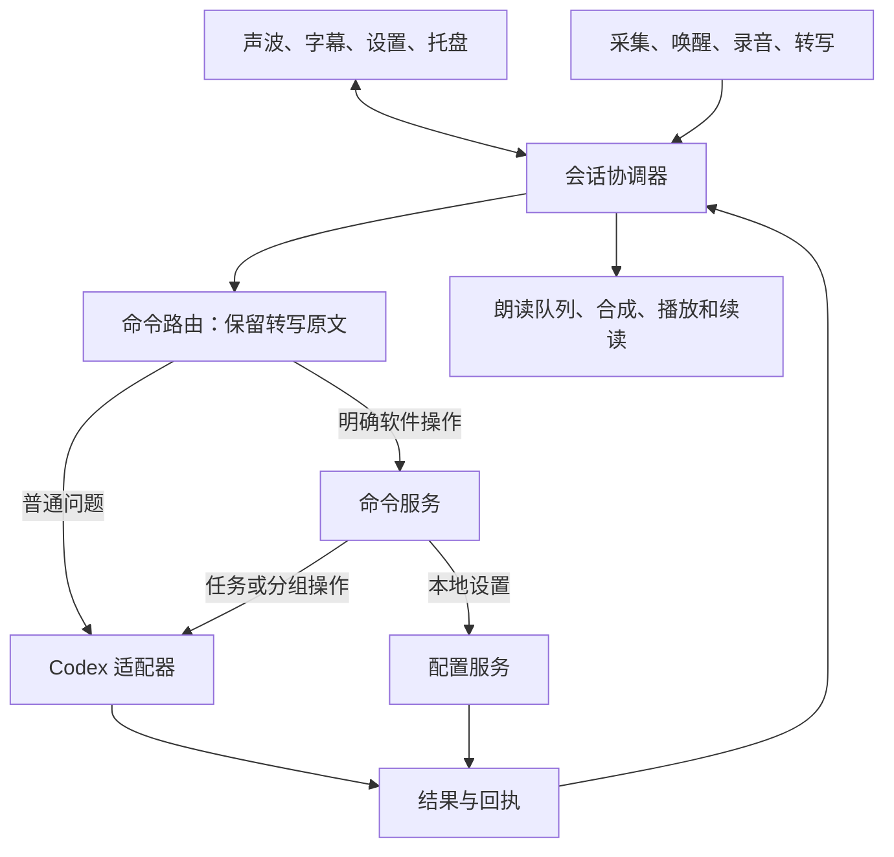

# 声伴架构设计

更新：2026-09-10。本文为从 0.6.12 逐步整理的目标设计，目录和接口示例不是已经完成的重构。0.6.13 已提取 TaskBinding；0.6.14 提取基础服务并统一版本；0.6.15 增加 PreferenceActions 和 CodexAdapter；0.6.16 提取 AudioOutput 管理合成、播放交接与资源清理。完整发行和设备矩阵仍按计划推进。

## 设计目标

同一任务投递准确、命令只执行一次、音频资源交接明确、状态可恢复，并使界面和连接方式可以独立演进。当前保留 PowerShell/WPF、C# 音频组件和 Python 工作进程；完整 .NET 桌面宿主迁移单独安排。

## 主要流程

## 模块责任与现有映射

| 目标模块 | 责任 | 现有实现主要位置 |
| --- | --- | --- |
| 桌面展示 | WPF 窗口、控件、样式和用户事件；不直接改业务内部状态 | DesktopShell、DesktopController、XAML、WaveformView、DesktopTopmost |
| 会话核心 | 明确绑定、草稿、代次、操作状态、用户轮次和事件协调 | Assistant、HandsFree、TaskSwitch、TaskCreate 中逐步提取 |
| 命令服务 | 解析与参数校验、统一执行入口、能力检查和反馈 | VoiceCommands、DesktopActionCommands、LocalCommands、DesktopActions、PreferenceActions（0.6.15 常用设置共用事务） |
| 语音输入 | 麦克风、回声处理、唤醒、人声和问题录音、识别工作进程 | MicGuard、EchoCapture、WakeListener、JarvisRecorder、transcribe、wake_worker |
| 语音输出 | 文本过滤、合成提供方、队列、暂停续播、音频位置和清理 | AudioOutput（合成和播放资源所有权）、reader-core、synthesize、AudioPlayer、PlaybackCommands；HandsFree 保留采集协调 |
| Codex 适配 | 任务发现、实时校验、发送、创建、整理与回答读取 | CodexAdapter（派发与回执校验）、codex_bridge、desktop_actions、task_creation、task_matcher、reader-core |
| 基础服务 | 设置、账本、文件所有权、进程生命周期、日志与版本 | Settings、PendingSends、Persistence、WorkerLifecycle、Version；创建及管理账本仍由各自模块负责 |

建议后续按 `src/ui`、`src/core`、`src/commands`、`src/audio`、`src/adapters`、`src/workers`、`src/infrastructure` 表达上述边界。迁移每一模块时同步修改加载与打包清单，并在对应回归通过后继续，避免先搬空所有路径。

## 状态与所有权

会话协调器拥有业务状态。工作进程和后台回调只提交结果，不能直接切换任务或清空界面。音频实时回调不得等待界面操作或网络调用。

分别管理以下状态，避免把所有情况塞进一个 busy 开关：

- 绑定：未连接、校验中、已连接、失效。
- 输入：待机、唤醒交接、录音、识别、待派发草稿。
- 操作：待派发、执行中、已确认成功、已确认失败、结果未知。
- 输出：空闲、等待合成、播放、暂停、可恢复书签。
- 设备：准备、就绪、释放中、恢复中、不可用。

异步结果携带请求编号、源任务、目标任务和必要的输入代次。新输入、切换、取消或退出使旧的展示与绑定结果失效；已经派发的写操作仍需记录最终回执。用户停止朗读只停止输出，不代表 Codex 工作停止。

当前绑定任务、临时查看任务和当前音频所属任务分别保存。设置页连接和语音切换必须经过同一个校验与提交入口。任务未确认前，后续草稿不得投递到旧目标。

## 接口约定

内部逐步采用统一命令对象，字段包括 `schemaVersion`、`requestId`、`operation`、`source`、`context` 和 `parameters`。`context` 保存真实任务编号及代次；`source` 区分手动与语音入口，不能由任务标题或回答内容伪造。

结果包含相同请求编号、操作名和四类状态：成功、失败、未知、待完成。附带可读消息和结构化错误码；布尔值及标识符严格检查。迁移层映射已有 JSON 返回值，首阶段不要求一次性替换所有现有协议或账本。

执行顺序：识别完整用户命令 → 校验参数与当前状态 → 查询真实能力和目标 → 持久记录写操作意图 → 派发一次 → 核对回执 → 更新结果 → 在上下文仍有效时反馈。

明确操作不因失败回落为聊天内容。普通问题保持识别原文，不经小模型先行摘要。引用、否定、测试和复合内容按已声明的范围处理，不靠关键词包含直接执行。

## 外部连接边界

现有 Codex 桌面管道与本地索引属于需要维护兼容性的适配器。检测真实能力和数据结构；未知版本或缺少能力时说明具体不可用项。不能编辑 Codex 私有数据库来补齐写操作。

后续其他连接方式独立适配，不以新建另一个后端任务替代用户原先绑定的任务。在线声音服务单独接入，合成失败不等于 Codex 断开。新增本地模型应作为可选组件，明确安装体积、资源占用和启停方式。

## 数据与部署

源码、运行依赖、用户状态和实验产物分别管理。发布阶段将用户状态迁到适当的用户数据目录，需提供可回退的旧配置迁移；本轮不移动 `data`。运行目录中的音频副本、临时输出和账本由创建它们的模块负责清理。

安装包与源码仓库分别构建，依赖和模型由清单确定来源、版本、校验值及分发范围。实验声音服务不会因文件仍在目录内就自动进入发行包。
